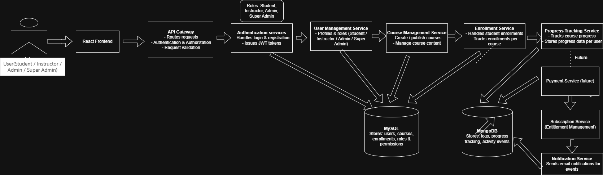

# SmartLearn – EdTech Microservices Platform

## Overview
SmartLearn is a scalable EdTech platform built using a microservices architecture to support online learning, course management, and user progress tracking.

## Tech Stack
- Frontend: React
- Backend: Laravel 12 (Microservices)
- Databases: MySQL, MongoDB
- Auth: JWT + RBAC
- DevOps: Docker, GitHub Actions (planned)

## Architecture

## Key Features
- Role-based access (Student, Instructor, Admin, Super Admin)
- Course creation & enrollment
- Progress tracking
- Email notifications

## Status
🚧 In active development (designed for real-world production use)
